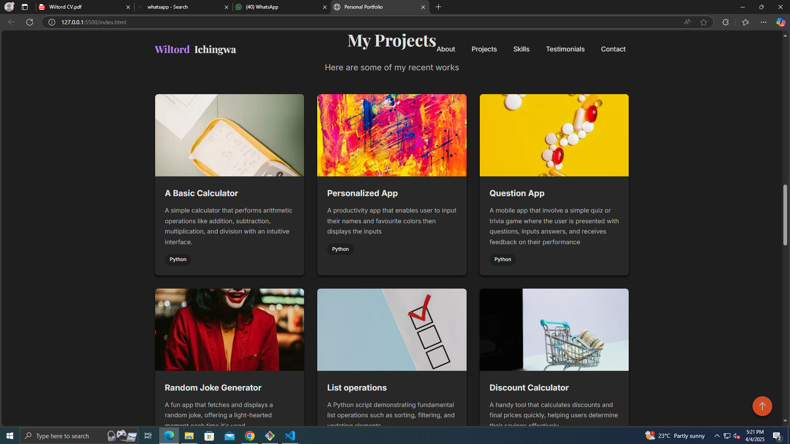
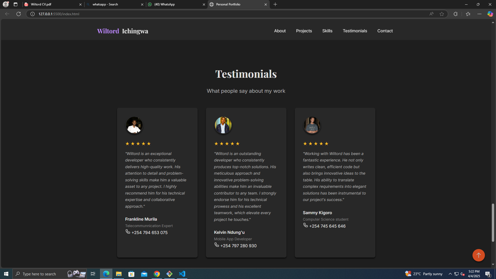

# Wiltord  Portfolio

Welcome to my personal portfolio website! I am **Wiltord**, a Software Engineer with a passion for building exceptional and accessible digital experiences for the web. This website showcases my work, skills, testimonials, and provides an easy way for potential collaborators to get in touch.
## My hosted website link

Check out the website of my portfolio:  
[Click Here](https://portfolio-hackathon1.onrender.com)

## Overview

This portfolio is a fully responsive, dark-themed website built using HTML and CSS only. It features:

- **Animated Header & Mobile Navigation:** A dynamic header with a toggle button for mobile users.
- **Hero Section:** A captivating introduction with a rotating blob animation and a smooth fade-in effect.
- **About Me Section:** An enhanced section with personal details, academic background, and professional goals.
- **Projects Section:** A grid of project cards featuring background images, hover overlays, and "View Project" buttons.
- **Skills Section:** Cleanly designed progress bars, technologies list, and services provided.
- **Testimonials Section:** Customer feedback cards with rounded profile images and a subtle hover lift effect.
- **Contact Section:** A detailed contact page with extra information about availability and response time, plus a contact form.

## Features

- **Responsive Design:** Adapts seamlessly across devices, with a mobile-friendly toggle navigation.
- **Dark Theme:** Modern and professional design optimized for high-contrast readability.
- **Smooth Animations:** Engaging animations including fade-ins, hover effects, and rotating backgrounds.
- **Accessible & Clean UI:** Designed to be user-friendly and accessible for everyone.

## Technologies Used

- **HTML5** for structure.
- **CSS3** for styling and animations.
- **SVG Icons** for crisp, scalable social media icons.
- **Render** Hosting platfofrm.

## Getting Started

1. **Clone the Repository:**

   ```bash
   git clone https://github.com/willy-havertz/portfolio-hackathon1.git
   cd portfolio-hackathon1

## Screenshots

### Homepage

### About Page

### Projects Page

### Skills and Technologies Page

## Testimonials Page


## Contacts

[](https://www.linkedin.com/in/wiltord-ichingwa)
[](https://github.com/willy-havertz)

